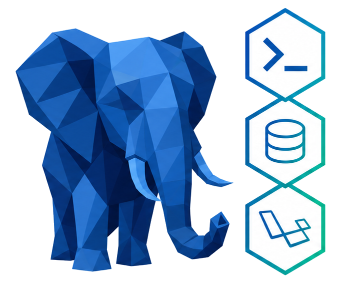
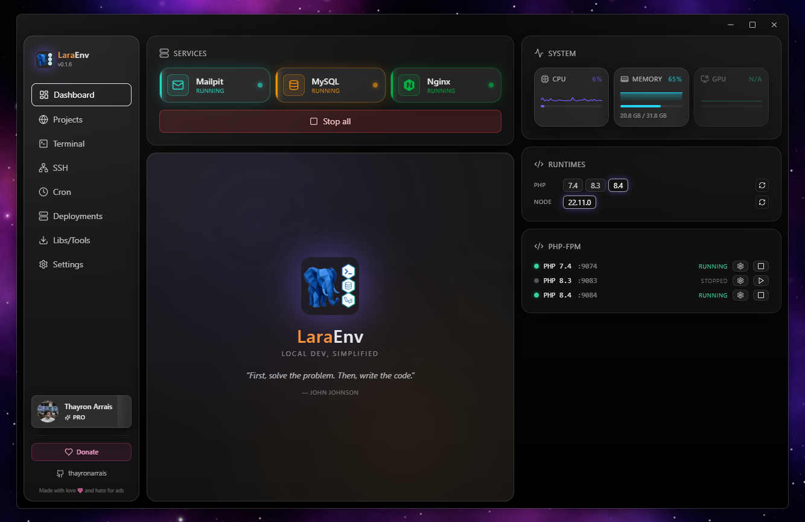
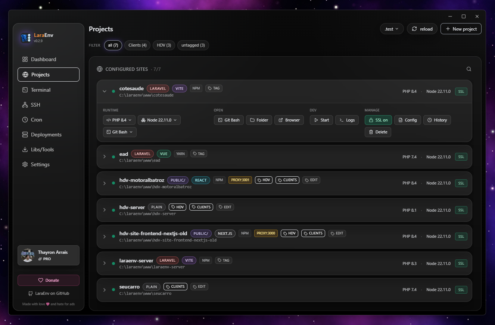
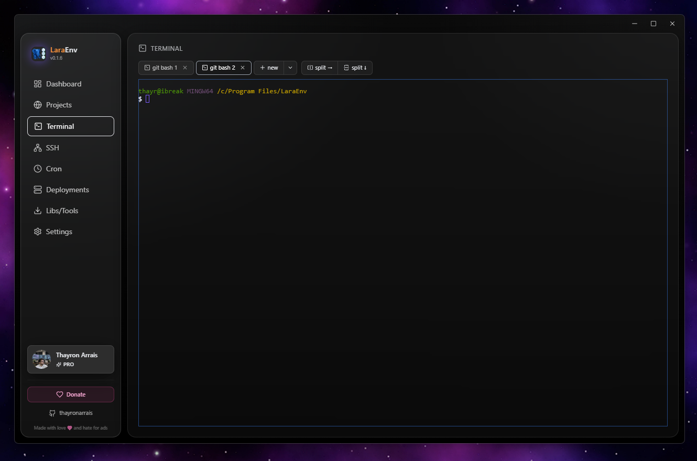
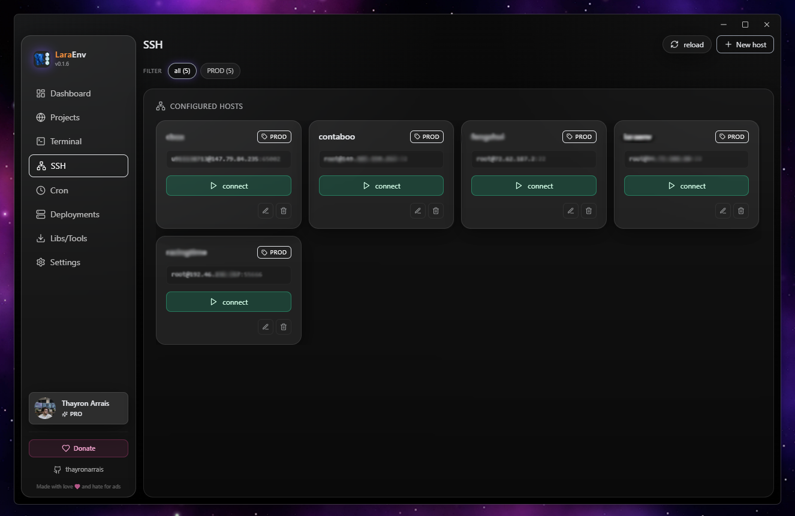
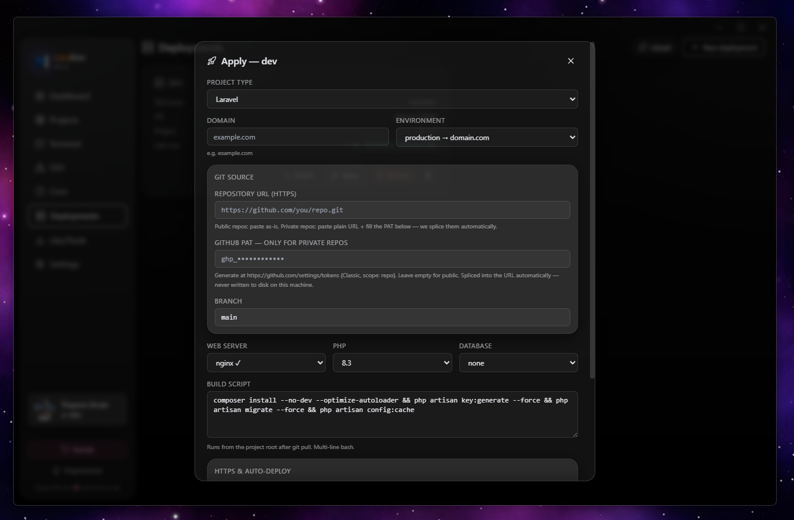
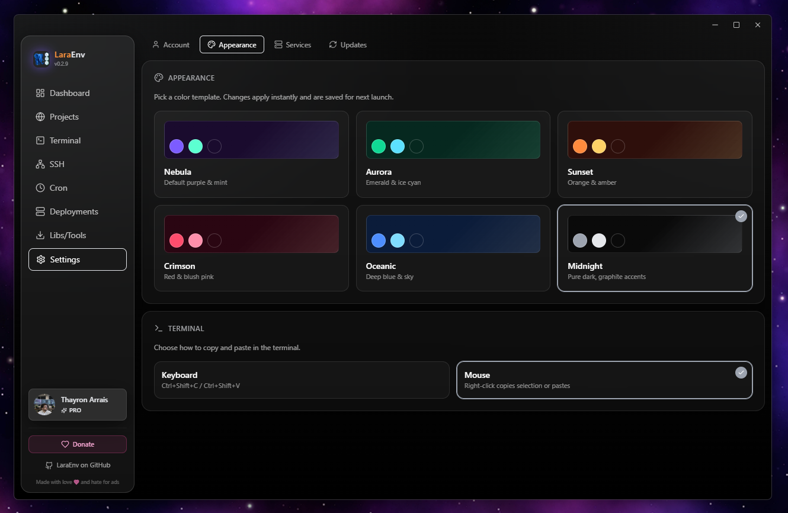

  

<h1 align="center">LaraEnv</h1>

  <strong>The ultimate development environment for Windows.</strong> 
  Replace Laragon or Herd with a more flexible, multi-runtime, and visually stunning tool. 
  Built with <a href="https://wails.io">Wails</a>, Go, and React. Native binary, no Docker, no WSL, no Electron.

  
  
  
  
  

  <a href="https://github.com/thayronarrais/laraenv/releases/latest/download/LaraEnv-Setup.msi"><strong>⬇️ Download MSI</strong></a> ·
  <a href="https://laraenv.com">🌐 Website</a> ·
  <a href="https://laraenv.com/pricing">💎 Pro</a> ·
  <a href="https://github.com/thayronarrais/laraenv/issues">🐞 Issues</a>

  

---

## Why LaraEnv?

- **No Docker. No WSL. No Electron.** Native Windows binary (~13 MB) running on WebView2.
- **Multi-runtime out of the box** — PHP 5.6 → 8.4 side-by-side, multiple Node versions, Python 3.13.
- **Real services, not containers** — Nginx, Apache, MySQL, PostgreSQL, Redis, Mailpit. Installed and started by the app.
- **Pro tier** — zero-knowledge cloud sync of your SSH keys / cron jobs and one-click VPS deploys.

---

## Download

| Asset | Notes |
|---|---|
| [`LaraEnv-Setup.msi`](https://github.com/thayronarrais/laraenv/releases/latest/download/LaraEnv-Setup.msi) | **Recommended.** Installs to `%ProgramFiles%\LaraEnv\`, Start Menu + Desktop shortcuts, clean uninstall via Control Panel. |
| `LaraEnv-x.y.z.msi` | Versioned copy of the same MSI (kept for archival). |
| `LaraEnv.exe` | Portable binary. No installer, just run. |
| `LaraEnv-x.y.z.msi.sha256` | SHA-256 sidecar. The in-app updater uses it to verify the download. |

**Requirements:** Windows 10/11 x64 · WebView2 Runtime (preinstalled on Win 11) · Administrator rights on first launch (to write `C:\Windows\System32\drivers\etc\hosts`).

All versions are on the [Releases page](https://github.com/thayronarrais/laraenv/releases). The in-app updater checks for new releases automatically and verifies them with SHA-256 before installing.

---

## Features

| | |
|---|---|
| 🚀 **Multi-runtime** | PHP 5.6 → 8.4 + multiple Node versions + Python 3.13 in parallel. Per-project overrides. Each PHP version gets its own FPM on a dedicated port (9074 for 7.4, 9084 for 8.4, etc). |
| 🌐 **Web servers** | Both **Nginx and Apache** with auto-generated vhosts per project. mod_proxy_fcgi / mod_rewrite / mod_ssl loaded automatically. Self-signed SSL toggle per project. |
| ⚙️ **Web server tuning UI** | Edit `client_max_body_size`, `fastcgi_read_timeout`, `proxy_read_timeout`, `worker_connections`, hash sizes — and Apache `Timeout`, `KeepAliveTimeout`, `LimitRequestBody`, `ProxyTimeout`. Saves rewrite the live config and reload the running service. Fixes 504-on-slow-uploads in dev. |
| 🗄️ **Databases** | MySQL **and** PostgreSQL with first-run init (`mysqld --initialize-insecure`, `initdb`). Auto-create the project DB and patch `.env` for Laravel scaffolds. |
| 📨 **Mail + cache** | Mailpit (SMTP catcher with UI on `:8025`) and Redis ready to start with one click. |
| 💻 **Terminal** | PowerShell, CMD, Git Bash, Cmder. Multi-tab plus **split panes** (horizontal and vertical). Tabs persist across page navigation. cwd and PATH wired to the active project's PHP/Node. |
| 🔐 **SSH manager** | ED25519 / RSA-4096 / ECDSA-P256 key generation, key import, host registry with tags, **ProxyJump** + ProxyCommand, latency + version probe, in-app interactive shell. |
| ⏰ **Cron** | 5/6-field expressions plus descriptors (`@hourly`, `@daily`). Per-job project context (PATH + cwd). Output captured into the UI. **Opt-in: run jobs even when LaraEnv is closed** via Windows Task Scheduler. |
| 📊 **System monitor** | Live CPU, Memory, GPU gauges with sparklines, plus a system-drive **Disk** progress bar. Sampled every 1.5 s. |
| 📁 **Projects** | Auto-detects type (Laravel / WordPress / plain), JS framework (React / Vue / Next / Nuxt / Astro), and package manager (npm / yarn / pnpm / bun). Templates: blank, Laravel, WordPress, Git clone, Vite, Next, Nuxt, Astro. |
| 🏷️ **Tags + filtering** | Free-form labels per project, comma-separated input, filter chips on the Projects page. Same model for SSH hosts. |
| 🔧 **Vhost editor** | Inline edit of the generated `nginx.conf` / Apache vhost with syntax highlighting. Reset-to-template in one click. |
| 🔁 **Reverse proxy** | Per-project proxy port for Vite / Next / Nuxt dev servers. WebSocket headers included so HMR works through the proxy. |
| ☁️ **Cloud sync (Pro)** | Zero-knowledge AES-256-GCM with Argon2id-derived keys — your SSH hosts, keys, cron jobs, and themes sync across machines without the server ever seeing the plaintext. |
| 🚢 **One-click deploy (Pro)** | Provision a VPS from a saved SSH host: install PHP / Nginx / MySQL / Node, configure vhost, issue Let's Encrypt cert, optional auto-deploy via remote `git pull` cron. |
| 🎨 **6 themes** | Nebula, Aurora, Sunset, Crimson, Oceanic, Midnight. |
| 🔄 **Auto-update + system tray** | In-app check, MSI download, SHA-256 verify, install. Hide to tray and keep services running. No telemetry. |

---

## A tour through the app

### Dashboard

Live status of every service, the runtimes you have installed, the PHP-FPM ports in use, and a real-time system monitor (CPU / Memory / GPU + Disk). Start everything with **Start all** or pick services individually.

  

### Projects

Auto-detection identifies what kind of project lives in each `www\` subfolder. Each card shows the URL, PHP version, SSL toggle, terminal kind, vhost config, and free-form tags. The TLD is configurable globally.

  

### Terminal

A real ConPTY terminal — not a fake one. Multi-tab, with split panes (`split →` horizontal, `split ↓` vertical). Each pane is a real session with persistent layout per tab. PowerShell, CMD, Git Bash, Cmder.

  

### SSH

Manage hosts, generate or import keys, test connections (TCP + handshake + version probe). Connect with one click — the session opens in the Terminal page. Filter by tag. Supports **ProxyJump** through any saved host (no credential re-entry) and an advanced **ProxyCommand** field for tools like `cloudflared access ssh`.

  

### Cron

Per-project schedules with output capture. Toggle **"Run when LaraEnv is closed"** on a job to register it with Windows Task Scheduler — the runner re-evaluates the cron expression every minute, so any robfig-compatible schedule works without translation.

### Deployments *(Pro)*

Pick a saved SSH host, choose project type, web server (Apache or Nginx), database (MySQL or PostgreSQL), PHP version, optional Let's Encrypt HTTPS, and a build script. Auto-deploy is a remote crontab that polls `git pull` at your chosen interval. Activity log of every apply / pull is kept per deployment.

  

### Libs / Tools

A curated catalog of every runtime and service the app supports — install with one click. PHP 5.6 to 8.4, Node LTS + Current, Python 3.13, Nginx, Apache, MySQL, PostgreSQL, Redis, Mailpit, Cmder.

### Settings

- **Account** — log in to LaraEnv Cloud (email/password or GitHub OAuth), see entitlements, manage billing.
- **Appearance** — pick one of 6 themes, terminal copy mode.
- **Services** — tuning UI for Nginx and Apache (`client_max_body_size`, timeouts, `LimitRequestBody`, etc).
- **Updates** — manual check, download, and install the latest MSI.

  

---

## Free vs Pro

|  | Free | Pro |
|---|:---:|:---:|
| Full local stack (PHP / Node / Nginx / Apache / MySQL / PostgreSQL / Redis / Mailpit) | ✅ | ✅ |
| Multi-PHP / multi-Node side-by-side | ✅ | ✅ |
| Project scaffolding & vhost management | ✅ | ✅ |
| SSH manager with ProxyJump | ✅ | ✅ |
| Cron with Task Scheduler integration | ✅ | ✅ |
| 6 themes & auto-update | ✅ | ✅ |
| **Cloud sync (zero-knowledge)** of SSH hosts, keys, crons | — | ✅ |
| **One-click VPS deploys** with Let's Encrypt | — | ✅ |
| **Auto-deploy on git push** | — | ✅ |
| Web dashboard at [laraenv.com/dashboard](https://laraenv.com/dashboard) | — | ✅ |

**LaraEnv Pro — $3 / month.** Subscribe via Stripe or PayPal at [laraenv.com/pricing](https://laraenv.com/pricing). Cancel anytime.

---

## Quick start

1. Download [`LaraEnv-Setup.msi`](https://github.com/thayronarrais/laraenv/releases/latest/download/LaraEnv-Setup.msi) and double-click.
2. On first launch, open **Libs/Tools** and install the runtimes you need (e.g. PHP 8.4, Node 22, Nginx, MySQL).
3. Hit **Start all** on the Dashboard.
4. Open **Projects** → **New project**, pick a template, give it a name. Vhost, hosts entry, and SSL are generated automatically.
5. Browse to `https://your-project.test`.

---

## Status

Used daily by the author. Bugs, feature requests, and screenshots are welcome on the [issue tracker](https://github.com/thayronarrais/laraenv/issues).

## License

Source-available. Releases are free to use; the desktop client is open. The cloud server (sync + deploy backend) is private.

---

This repository hosts the **binary releases** of the LaraEnv desktop app. Marketing, accounts, billing, and the Pro API live at [laraenv.com](https://laraenv.com).

Made with ❤️ and hate for ads.
